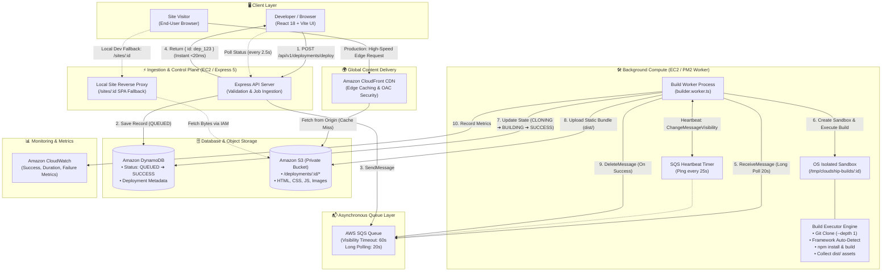
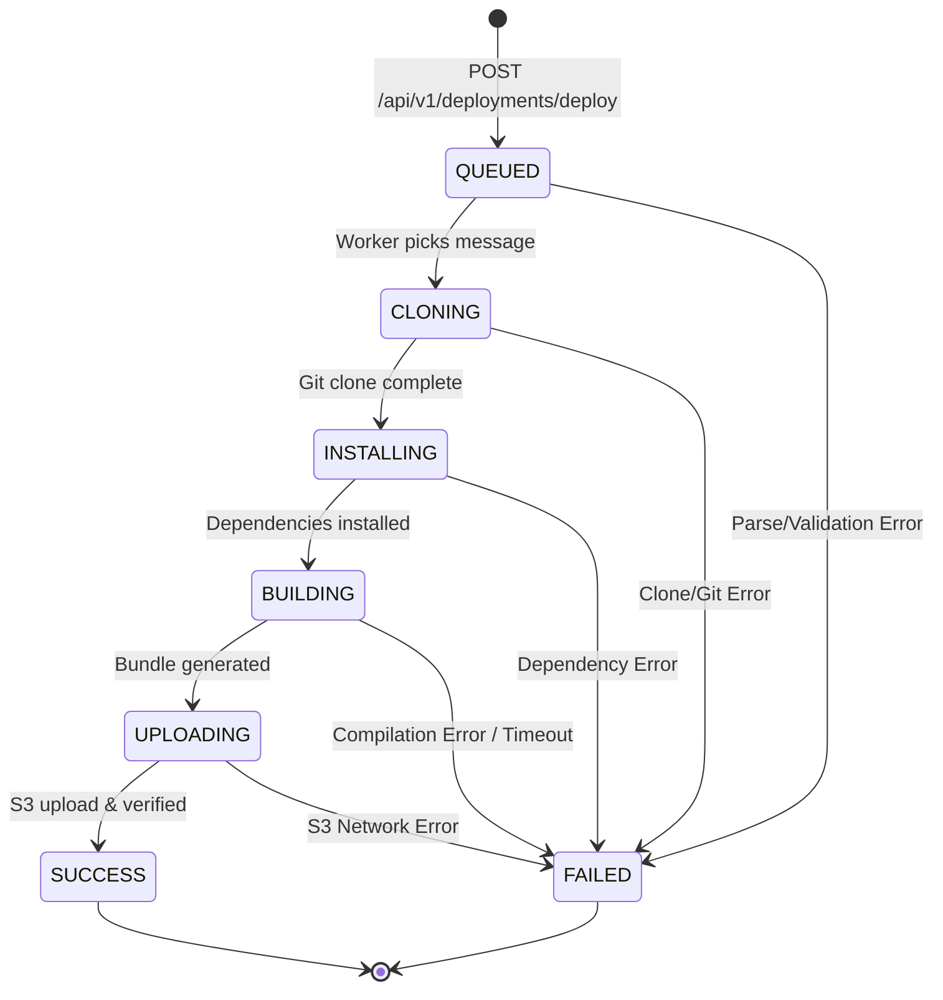

# ⚡ CloudShip — System Architecture & Whiteboard Guide

This document contains the complete system architecture for **CloudShip**, structured both as a **Mermaid Diagram** and a simplified **ASCII Whiteboard Diagram** that you can quickly draw on paper or a whiteboard in a technical interview.

---

## 1. High-Level Architecture Diagram



---

## 2. Whiteboard-Friendly Diagram (How to Draw in an Interview ✍️)

Draw these **5 main boxes** and connect them with numbered arrows in under 60 seconds:

```
+-----------------------------------------------------------------------------+
|                                DEVELOPER UI                                 |
|                            (React 18 Dashboard)                             |
+-----------------------------------------------------------------------------+
         │ (1) POST /deploy                     ▲ (Poll Status / Live URL)
         ▼                                      │
+------------------+     (2) Write QUEUED     +-------------------------------+
|  EXPRESS API     |─────────────────────────▶|       AMAZON DYNAMODB         |
|  (Control Plane) |                          |  (Metadata & State Machine)   |
+------------------+                          +-------------------------------+
         │                                              ▲
         │ (3) SendMessage                              │ (7) Update State
         ▼                                              │     (CLONING ➔ SUCCESS)
+------------------+                          +-------------------------------+
|     AWS SQS      |─────────────────────────▶|      BUILD WORKER (EC2)       |
|  (Message Queue) |   (4) ReceiveMessage     |  • Clones Repo in /tmp        |
+------------------+   (Long Poll 20s)        |  • npm install & npm build    |
         ▲                                    |  • SQS Visibility Heartbeat   |
         │                                    +-------------------------------+
         │ (Heartbeat ping every 25s)                   │
         └──────────────────────────────────────────────┘
                                                        │ (8) Upload static bundle
                                                        ▼
+-------------------+      Origin Fetch (Miss)     +--------------------------+
|  VISITOR BROWSER  |◀─────────────────────────────|        AMAZON S3         |
|   (Public User)   |  (9) Deliver Assets (<10ms)  |  (Private Object Storage)|
+-------------------+                              +--------------------------+
         ▲                                              ▲
         │                                              │ Origin Access (OAC)
         └───────────── [ AMAZON CLOUDFRONT CDN ] ──────┘
                         (Global Edge Caching)
```

---

## 3. Step-by-Step Data Flow Walkthrough

| Step # | Component | Action Description |
| :--- | :--- | :--- |
| **1** | **Developer ➔ API** | User submits GitHub URL, branch, and optional env vars. React UI sends `POST /api/v1/deployments/deploy`. |
| **2** | **API ➔ DynamoDB** | API validates input with Zod, generates a unique ID (`dep_UUID`), and saves metadata with status `QUEUED`. |
| **3** | **API ➔ SQS** | API enqueues job payload into AWS SQS. API immediately returns HTTP 200 with deployment ID to client. |
| **4** | **SQS ➔ Worker** | Worker long-polls SQS (`WaitTimeSeconds: 20`), receives the message, and checks idempotency in DynamoDB. |
| **5** | **Worker (Heartbeat)** | Worker starts a background timer calling `changeMessageVisibility` every 25s so the job doesn't time out during long builds. |
| **6** | **Worker (Build)** | Worker clones repo into `/tmp`, auto-detects project structure (React/Vue/Static/Monorepo), and runs `npm install` + `npm run build`. |
| **7** | **Worker ➔ S3** | Worker collects compiled files (`dist/` or `build/`) and uploads them to S3 under `deployments/{deploymentId}/` with proper MIME headers. |
| **8** | **Worker ➔ State** | Worker verifies S3 upload, sets status to `SUCCESS` with live URL in DynamoDB, and deletes message from SQS. |
| **9** | **Visitor ➔ Site** | Public visitors load the website through **CloudFront CDN** (or local Express proxy), which pulls files from private S3 with SPA fallback. |

---

## 4. Serving Model: Production vs. Local Development

CloudShip supports two complementary serving modes:

```
1. PRODUCTION SERVING (CloudFront CDN):
   Visitor ──▶ Amazon CloudFront (Edge) ──(Cache Miss)──▶ Amazon S3 (Private)
   • Zero load on Express API Server.
   • Sub-millisecond latency globally.
   • SSL/TLS via AWS Certificate Manager (ACM).

2. LOCAL DEVELOPMENT SERVING (Express Reverse Proxy):
   Visitor ──▶ Express API Server (/sites/:id/*) ──▶ Amazon S3 (Private)
   • Works on localhost without needing AWS DNS setup.
   • Includes automatic SPA fallback: missing routes automatically return index.html.
```

---

## 5. Deployment State Machine Transitions


