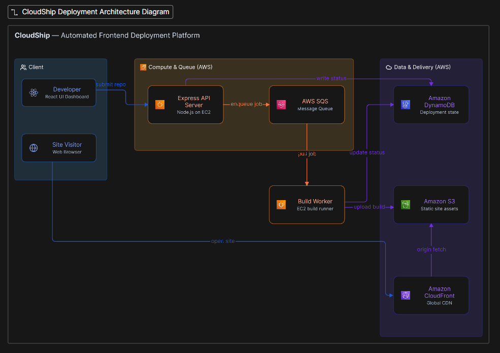

# ⚡ CloudShip

> **Serverless Frontend Deployment & Hosting Platform**

CloudShip is an automated web deployment platform inspired by Vercel. It allows developers to submit any public GitHub repository URL and automatically clones, builds, and hosts static web applications on AWS S3 with clean live preview URLs.

---

## 🏗️ Architecture & Data Flow



### System Workflow

1. **API Layer**: Validates deployment requests using Zod schemas and saves initial `QUEUED` records into AWS DynamoDB.
2. **Asynchronous Queue**: Pushes build jobs into AWS SQS to prevent API thread blocking.
3. **Decoupled Worker Engine**: Continuously polls SQS, executes `git clone`, auto-detects repository structure (root, monorepo subdirectories, or static HTML), installs dependencies (`npm install`), and compiles production bundles (`npm run build`).
4. **Storage & Proxy Engine**: Uploads compiled static assets to AWS S3 and streams them back via clean Express reverse-proxy routes (`/sites/:id`) with Single Page Application (SPA) fallback handling.

---

## ✨ Key Features

- 🚀 **One-Click Deployments**: Instant deployment from any public GitHub repository URL.
- ⚡ **Asynchronous Worker Pipeline**: Non-blocking build queue backed by AWS SQS and background worker polling.
- 📁 **Smart Monorepo Detection**: Auto-detects frontend root (`./`), subdirectories (`frontend/`, `client/`, `web/`, `app/`), and raw static HTML sites.
- 🛠️ **Custom Build Configuration**: Support for custom branch selection, directory overrides, custom slugs, and build-time environment variables.
- 📺 **Retro CRT Terminal & Stepper**: Real-time visual progress tracker (`QUEUED` ➔ `CLONING` ➔ `INSTALLING` ➔ `BUILDING` ➔ `UPLOADING` ➔ `SUCCESS`) paired with a live timestamped terminal output console.
- 🔗 **Clean Reverse Proxy**: Serves deployed static sites securely without exposed raw bucket URLs.

---

## 🛠️ Tech Stack

- **Frontend**: React 18, Vite, TypeScript, Retro-Arcade CSS Design System
- **Backend API**: Node.js, Express 5, TypeScript, Zod Validation, Pino Logger
- **Build Worker**: Node.js Child Processes, AWS SDK v3
- **AWS Cloud Infrastructure**: AWS SQS (Message Queue), AWS S3 (Object Storage), AWS DynamoDB (Deployment Database), AWS CloudWatch (Metrics)

---

## 🚀 Getting Started

### Prerequisites

- Node.js >= 18
- AWS Account with SQS, S3, and DynamoDB configured
- AWS Credentials configured in environment variables

### Local Setup

1. **Clone the repository**

   ```bash
   git clone https://github.com/Akashh-17/cloudship.git
   cd cloudship
   ```

2. **Configure Backend Environment (`backend/.env`)**

   ```env
   PORT=3000
   NODE_ENV=development
   AWS_REGION=ap-south-1
   AWS_ACCESS_KEY_ID=your_access_key
   AWS_SECRET_ACCESS_KEY=your_secret_key
   SQS_QUEUE_URL=https://sqs.ap-south-1.amazonaws.com/xxx/cloudship-deployments-queue
   S3_BUCKET_NAME=cloudship-deployments-bucket-xxx
   DYNAMODB_TABLE_NAME=cloudship-deployments
   ```

3. **Start the API Server**

   ```bash
   cd backend
   npm install
   npm run dev
   ```

4. **Start the Build Worker (in a separate terminal)**

   ```bash
   cd backend
   npm run worker
   ```

5. **Start the Frontend UI (in a separate terminal)**
   ```bash
   cd frontend
   npm install
   npm run dev
   ```
   Open `http://localhost:5173` in your browser.

---

## ⚠️ Known Limitations

- **Frontend Static Sites Only**: Built specifically for static frontend frameworks (React, Vite, Vue, HTML/CSS). Server-Side Rendering (SSR / Node.js backend servers) is not supported.
- **Node.js Build Environment**: Build sandbox currently supports Node.js/npm-based projects and static HTML sites (Python, Go, or Rust static site generators are not pre-installed in the worker environment).
- **Public Repositories**: Currently supports public GitHub repositories. Deploying private repositories requires GitHub Personal Access Token (PAT) authentication.
