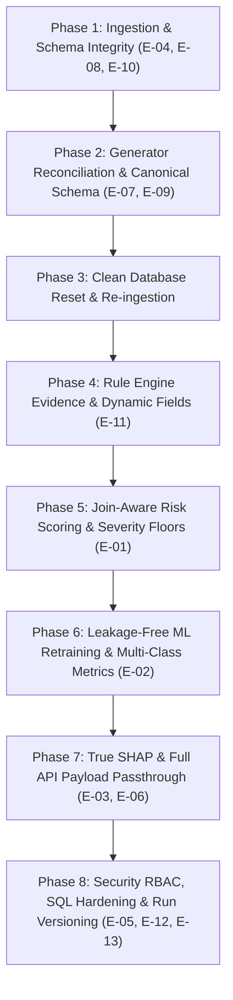

# Fin-Comply DPDP Engine: End-to-End Remediation Implementation Plan

This implementation plan provides a comprehensive, research-backed engineering blueprint to resolve issues **E-01 through E-13** in the Fin-Comply DPDP Compliance Engine.

The remediation follows a **strict 8-phase sequence** governed by the foundational rule: **"Fix Data Before Models."** Each phase must be verified before proceeding downstream to prevent propagating corrupted data and placeholders into the rule engine, risk scoring, and ML models.

Throughout this plan, the tenant **`QUICKLOAN-001`** (a digital lending fintech with personal loan disbursals, KYC data, third-party credit bureaus, and collection workflows) is used to illustrate how each fix operates.

---

## User Review Required

> [!IMPORTANT]
> **Key Architectural Decisions in this Plan:**
> 1. **Data Ingestion Behavior (E-04):** Ingestion will no longer manufacture fake expired consent records or fake third-party entities when an uploaded row contains an invalid foreign key. Instead, missing FKs will be logged and skipped/rejected.
> 2. **Tenant Re-upload Protocol (E-10):** When a tenant re-uploads files, the system will execute an atomic single-tenant slice deletion/replacement within a database transaction rather than silently dropping updates via `ON CONFLICT DO NOTHING`.
> 3. **Opportunity Count Calculation (E-01):** The rule engine will calculate `violation_count / opportunity_count` by executing join-aware count queries for each rule, rather than dividing by total table row count.
> 4. **Project Severity Policy (E-01):** Any `CRITICAL` finding enforces a risk score floor of **65 (`HIGH`)**; 3+ `HIGH` findings enforce a floor of **45 (`MEDIUM`)**.
> 5. **Explainability Metric Split (E-06):** Deterministic rule signal weights will be clearly labeled as `signal_contribution` across APIs and PDFs. TreeSHAP values will come exclusively from the XGBoost ML layer.

---

## Remediation Roadmap & Dependency Chain



---

## Detailed Issue-by-Issue Remediation Plan

### Phase 1: Ingestion & Schema Integrity (E-04, E-08, E-10)

#### 1. Stop Manufacturing Consent & Third-Party Placeholders (E-04)
* **Problem:** In [`src/anonymization/db_writer.py`](file:///c:/Users/aakas/OneDrive/Desktop/capstone_f/src/anonymization/db_writer.py#L127-L151) and [L280-L298](file:///c:/Users/aakas/OneDrive/Desktop/capstone_f/src/anonymization/db_writer.py#L280-L298), if `transaction_events` references a non-existent `consent_hash` or `third_party_hash`, the writer inserts an artificial `expired` consent record and a fake system with `dpa_signed=False`.
* **QuickLoan Example:** QuickLoan uploads transaction `TX-901` referencing `consent_hash=C123`. `C123` was never uploaded. The engine creates `C123` marked `expired`, which then triggers a false DPDP-001 violation against QuickLoan.
* **Fix:** 
  1. Remove the placeholder insertion logic in `db_writer.py`.
  2. Validate foreign keys against pre-existing parent tables (`consent_records`, `system_inventory`, `customer_master`).
  3. If an FK is missing, log a data-quality warning and set the FK column to `NULL` (or skip the orphaned event), preventing phantom records from contaminating the database.

#### 2. Preserve Uploaded DPA Flags in Mapper (E-08)
* **Problem:** In [`src/anonymization/field_mapper.py:L378-L383`](file:///c:/Users/aakas/OneDrive/Desktop/capstone_f/src/anonymization/field_mapper.py#L378-L383), `dpa_signed` is hardcoded to `False` for internal systems and `True` for third parties, ignoring what the tenant actually uploaded.
* **QuickLoan Example:** QuickLoan uploads an external payment gateway with `dpa_signed = False`. The mapper overwrites it to `True`, hiding a real non-compliance issue. Conversely, an internal database is forced to `dpa_signed = False`, which causes false alarms.
* **Fix:** 
  1. Update `field_mapper.py` to parse the raw uploaded value:
     ```python
     dpa_signed = _safe_bool(row.get("dpa_signed"))
     dpa_expiry_date = _truncate_to_date(row.get("dpa_expiry_date"))
     ```
  2. In the rule definition (`DPDP-016`), restrict evaluation strictly to `data_processor_type != 'internal'`.

#### 3. Atomic Tenant Replacement (E-10)
* **Problem:** 12+ queries in [`src/anonymization/db_writer.py`](file:///c:/Users/aakas/OneDrive/Desktop/capstone_f/src/anonymization/db_writer.py) use `ON CONFLICT DO NOTHING`, causing updated tenant uploads to be ignored.
* **QuickLoan Example:** QuickLoan re-uploads `consent_records` after obtaining fresh consents (`consent_status='active'`). Because records already exist, `DO NOTHING` leaves the old expired records intact.
* **Fix:** Wrap tenant ingestion in a single atomic transaction:
  ```sql
  -- For a full tenant upload cycle:
  DELETE FROM transaction_events WHERE tenant_id = %(tenant_id)s;
  DELETE FROM consent_records WHERE tenant_id = %(tenant_id)s;
  DELETE FROM customer_master WHERE tenant_id = %(tenant_id)s;
  ...
  -- Followed by clean batch INSERTs without DO NOTHING masking.
  ```

---

### Phase 2: Synthetic Generator Reconciliation (E-07, E-09)

#### 1. Consolidate to a Single Canonical Generator (E-09)
* **Problem:** Two incompatible generator scripts exist (`data/generate_data.py` producing unhashed CSVs and `data/generate_test_tenants.py` producing pre-hashed CSVs).
* **Fix:**
  1. Standardize on one profile-driven generator (`data/generate_test_tenants.py` or unified `generator.py`) that accepts deterministic seeds (`--seed 42`) and tenant scenario profiles.
  2. Strict generation order guaranteeing referential integrity:
     $$\text{Governance} \rightarrow \text{Systems} \rightarrow \text{Policies} \rightarrow \text{Customers} \rightarrow \text{Consents} \rightarrow \text{Transactions} \rightarrow \text{Logs} \rightarrow \text{Lifecycle} \rightarrow \text{Security} \rightarrow \text{DSAR}$$

#### 2. Canonical Column Naming: `guardian_consent_hash` (E-07)
* **Problem:** Generator and mapper mismatch between `guardian_consent_id` and `guardian_consent_hash`.
* **Fix:** Standardize on canonical raw name `guardian_consent_id` in raw CSVs and canonical database column `guardian_consent_hash` across `field_config.json`, `field_mapper.py`, `field_registry_f.py`, and rule queries.

---

### Phase 3: Clean Database Reset & Re-ingestion

* **Goal:** Eradicate all historic placeholder contamination and stale state.
* **Actions:**
  1. Run `TRUNCATE` / clean rebuild of all tables for test tenants in PostgreSQL.
  2. Regenerate tenant datasets (e.g. `QUICKLOAN-001`, `PAYFLEX-002`, `WEALTHNEST-003`, `RURALCRED-004`, `NEXUSNEOBANK-005`) using the consolidated generator.
  3. Ingest fresh CSVs through the updated `field_mapper.py` and `db_writer.py`.

---

### Phase 4: Rule Engine Evidence & Dynamic Fields (E-11)

#### 1. Dynamic `fields_triggered` Population (E-11)
* **Problem:** [`src/api/routes.py:L224`](file:///c:/Users/aakas/OneDrive/Desktop/capstone_f/src/api/routes.py#L224) hardcodes `fields_triggered=[]`, discarding signal evidence.
* **QuickLoan Example:** QuickLoan triggers `DPDP-001` because `consent_status == 'expired'` and `event_date > expiry_date`. The API returns `fields_triggered: []`, making automated audit tools unable to verify what caused the trigger.
* **Fix:** 
  1. In [`src/agent_layer/signal_evaluator.py`](file:///c:/Users/aakas/OneDrive/Desktop/capstone_f/src/agent_layer/signal_evaluator.py), extract the exact field names evaluated when a signal fires.
  2. Attach `fields_triggered: List[str]` to `ViolationRecord`.
  3. In `src/api/routes.py`, map `rv.fields_triggered` directly into `ViolationItem(fields_triggered=...)`.

---

### Phase 5: Join-Aware Risk Scoring & Severity Floors (E-01)

#### 1. Join-Aware Opportunity Denominator (E-01 Ratio)
* **Problem:** [`src/agent_layer/orchestrator.py:L227-L236`](file:///c:/Users/aakas/OneDrive/Desktop/capstone_f/src/agent_layer/orchestrator.py#L227-L236) computes:
  $$\text{prevalence\_ratio} = \frac{\text{affected\_rows}}{\text{total\_table\_rows}}$$
* **QuickLoan Example:** QuickLoan processes 50,000 transactions, but only 200 are third-party transfers (`DPDP-006`). If all 200 fail DPA checks, $200 / 50000 = 0.4\%$, diluting a 100% failure rate down to negligible noise.
* **Fix:** 
  1. Store an `opportunity_query` or `applicability_filter` for each rule in the `rules` database table.
  2. For multi-table rules, execute the join-aware count query:
     ```sql
     -- For DPDP-006 (Third party sharing):
     SELECT COUNT(*) FROM transaction_events WHERE tenant_id = %s AND shared_with_third_party = TRUE;
     
     -- For DPDP-005 (Minor data without guardian consent):
     SELECT COUNT(*) FROM customer_master cm 
     WHERE cm.tenant_id = %s AND cm.is_minor = TRUE;
     ```
  3. Compute $\text{prevalence\_ratio} = \min\left(\frac{\text{violation\_count}}{\max(\text{opportunity\_count}, 1)}, 1.0\right)$.

#### 2. Explicit Severity Floor Policy (E-01 Severity)
* **Problem:** Aggregated weighted sums allow critical violations to land in `LOW` tier.
* **QuickLoan Example:** QuickLoan has 1 minor data violation under Section 9 (₹200 Cr maximum fine). Because it passes 20 other minor rules, the overall score calculates to 12.5 (`LOW`).
* **Fix:** Implement explicit post-aggregation project policy in `orchestrator.py`:
  ```python
  # Apply project severity floors
  has_critical = any(v.severity == "CRITICAL" for v in violations_only)
  high_count = sum(1 for v in violations_only if v.severity == "HIGH")

  if has_critical:
      risk_score = max(risk_score, 65.0)  # Guarantees HIGH tier minimum
  elif high_count >= 3:
      risk_score = max(risk_score, 45.0)  # Guarantees MEDIUM tier minimum
  ```

---

### Phase 6: Leakage-Free ML Pipeline & Evaluation (E-02)

#### 1. Encapsulate SMOTE in `imblearn.pipeline.Pipeline` (E-02 Leakage)
* **Problem:** [`src/modeling/train_risk_model.py:L35`](file:///c:/Users/aakas/OneDrive/Desktop/capstone_f/src/modeling/train_risk_model.py#L35) applies SMOTE before cross-validation splitting and evaluates on training data.
* **QuickLoan Example:** Synthetic samples generated from QuickLoan's validation fold leak into training folds, yielding artificial 99% accuracy that drops in production.
* **Fix:**
  1. Reserve an untouched stratified holdout test set (20%) first.
  2. Wrap SMOTE + XGBoost in an `imblearn.pipeline.Pipeline`:
     ```python
     from imblearn.pipeline import Pipeline
     from imblearn.over_sampling import SMOTE
     import xgboost as xgb
     
     model_pipeline = Pipeline([
         ("smote", SMOTE(random_state=42)),
         ("xgb", xgb.XGBClassifier(
             max_depth=3, n_estimators=100, learning_rate=0.1,
             eval_metric="mlogloss", random_state=42
         ))
     ])
     ```
  3. Perform 5-fold Stratified CV on training set; evaluate final metrics strictly on the untouched test holdout.

#### 2. Multi-Class Imbalance Metrics (E-02 Metrics)
* **Fix:** Replace overall accuracy with **Macro F1**, **Matthews Correlation Coefficient (MCC)**, and per-class precision/recall confusion matrix.

---

### Phase 7: True SHAP & Full API Payload Passthrough (E-03, E-06)

#### 1. Label Heuristics vs TreeSHAP Explicitly (E-06)
* **Problem:** Static signal weights in [`src/explainability/service.py`](file:///c:/Users/aakas/OneDrive/Desktop/capstone_f/src/explainability/service.py) are labeled `phi` and summed into `total_shap`.
* **Fix:**
  1. Rename static rule signal contributions to `signal_contribution` and `total_signal_weight`.
  2. Reserve `shap_value` and `TreeSHAP` exclusively for XGBoost feature attributions generated by `ml_layer.py`.

#### 2. Expose `ml_layer` in API Schema (E-03)
* **Problem:** [`src/api/schemas.py`](file:///c:/Users/aakas/OneDrive/Desktop/capstone_f/src/api/schemas.py) omits `ml_layer` from `AnalyzeResponse`.
* **Fix:**
  1. Add `ml_layer: Optional[Dict[str, Any]] = None` to `AnalyzeResponse` in `schemas.py`.
  2. Pass `ml_layer=final_report.get("ml_layer")` in `src/api/routes.py`.

---

### Phase 8: Security RBAC, SQL Hardening & Governance (E-05, E-12, E-13)

#### 1. Secure Rule-Management Endpoints (E-05)
* **Problem:** [`src/api/routes.py:L589`](file:///c:/Users/aakas/OneDrive/Desktop/capstone_f/src/api/routes.py#L589) allows unauthenticated callers to approve/reject active system rules.
* **Fix:** Add FastAPI authentication and role-checking dependency:
  ```python
  @router.post("/rules/approve/{proposal_id}")
  def approve_rule(
      proposal_id: int,
      current_user: User = Depends(require_role("admin"))
  ):
      ...
  ```

#### 2. Safe SQL Identifier Composition (E-12)
* **Problem:** [`src/agent_layer/orchestrator.py:L133`](file:///c:/Users/aakas/OneDrive/Desktop/capstone_f/src/agent_layer/orchestrator.py#L133) formats dynamic table names via f-strings.
* **Fix:** Whitelist permitted table names and use `psycopg.sql.Identifier`:
  ```python
  from psycopg.sql import SQL, Identifier

  ALLOWED_TABLES = {"customer_master", "consent_records", "transaction_events", ...}
  if table not in ALLOWED_TABLES:
      raise ValueError(f"Invalid table: {table}")
      
  query = SQL("SELECT COUNT(*) AS count FROM {tbl} WHERE tenant_id = %s").format(
      tbl=Identifier(table)
  )
  ```

#### 3. Run-Level Versioning (E-13)
* **Problem:** Audit logs do not capture model hashes, rule versions, or schema versions.
* **Fix:** Create a `run_metadata` table in PostgreSQL and record `(run_id, tenant_id, timestamp, rules_version, schema_version, model_hash, git_commit)` on every `/analyze` invocation.

---

## File-by-File Modification Plan

| Component | Target File | Action | Issues Addressed |
| :--- | :--- | :---: | :--- |
| **Ingestion** | [`src/anonymization/db_writer.py`](file:///c:/Users/aakas/OneDrive/Desktop/capstone_f/src/anonymization/db_writer.py) | `[MODIFY]` | E-04 (no fake placeholders), E-10 (atomic tenant replacement) |
| **Mapper** | [`src/anonymization/field_mapper.py`](file:///c:/Users/aakas/OneDrive/Desktop/capstone_f/src/anonymization/field_mapper.py) | `[MODIFY]` | E-08 (read uploaded DPA), E-07 (guardian consent canonical name) |
| **Generators** | [`data/generate_test_tenants.py`](file:///c:/Users/aakas/OneDrive/Desktop/capstone_f/data/generate_test_tenants.py) | `[MODIFY]` | E-09 (deterministic seed, FK chain, canonical headers) |
| **Rule Engine** | [`src/agent_layer/signal_evaluator.py`](file:///c:/Users/aakas/OneDrive/Desktop/capstone_f/src/agent_layer/signal_evaluator.py) | `[MODIFY]` | E-11 (return triggered field list) |
| **Orchestrator** | [`src/agent_layer/orchestrator.py`](file:///c:/Users/aakas/OneDrive/Desktop/capstone_f/src/agent_layer/orchestrator.py) | `[MODIFY]` | E-01 (opportunity denominator + severity floors), E-12 (SQL identifier security) |
| **ML Training** | [`src/modeling/train_risk_model.py`](file:///c:/Users/aakas/OneDrive/Desktop/capstone_f/src/modeling/train_risk_model.py) | `[MODIFY]` | E-02 (pipeline SMOTE, untouched test holdout, Macro F1/MCC) |
| **API Schemas** | [`src/api/schemas.py`](file:///c:/Users/aakas/OneDrive/Desktop/capstone_f/src/api/schemas.py) | `[MODIFY]` | E-03 (include `ml_layer`), E-06 (relabel `signal_contribution`) |
| **API Routes** | [`src/api/routes.py`](file:///c:/Users/aakas/OneDrive/Desktop/capstone_f/src/api/routes.py) | `[MODIFY]` | E-03 (pass ML layer), E-05 (RBAC on rule approval), E-11 (pass fields_triggered) |
| **Governance** | [`src/governance/audit_logger.py`](file:///c:/Users/aakas/OneDrive/Desktop/capstone_f/src/governance/audit_logger.py) | `[MODIFY]` | E-13 (persist model hash, rule version, schema version) |
| **Database** | [`db/schema.sql`](file:///c:/Users/aakas/OneDrive/Desktop/capstone_f/db/schema.sql) | `[MODIFY]` | E-01 (`applicability_filter`), E-13 (`run_metadata` table) |

---

## Verification & Validation Plan

### Automated Regression & Unit Testing
1. **Ingestion Verification:**
   * Test uploading a CSV referencing non-existent IDs. Confirm **zero** synthetic rows created in `consent_records` or `system_inventory`.
2. **Scoring Verification:**
   * Test QuickLoan with 1 critical finding (children's data). Confirm score $\ge 65$ (`HIGH`), verifying the severity floor.
   * Test 100% failure on a 200-row subset in a 50,000-row table. Confirm rule rate is 100%, verifying opportunity denominator.
3. **ML Pipeline Leakage Test:**
   * Run training script. Confirm SMOTE only fits on training folds and holdout set is evaluated without synthetic samples.
4. **API Security Test:**
   * Send unauthenticated `POST /api/rules/approve/1`. Confirm `401 Unauthorized` / `403 Forbidden`.
5. **API ML Schema Test:**
   * Call `POST /api/analyze`. Verify response contains both deterministic `violations` with populated `fields_triggered` and the complete `ml_layer` object.
